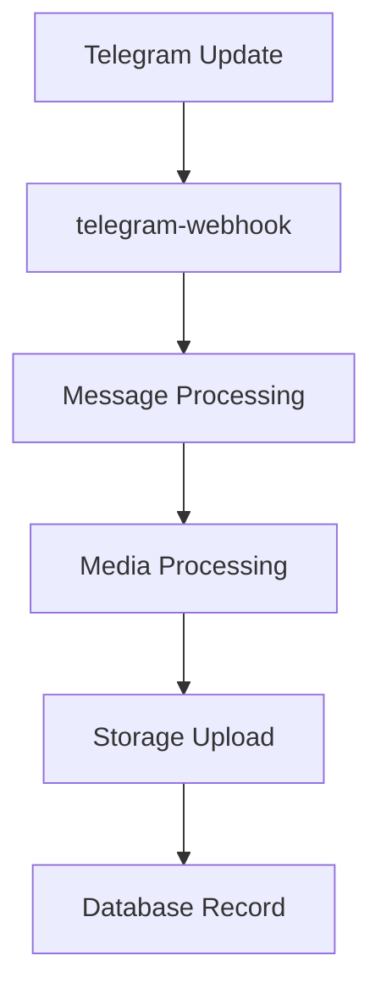
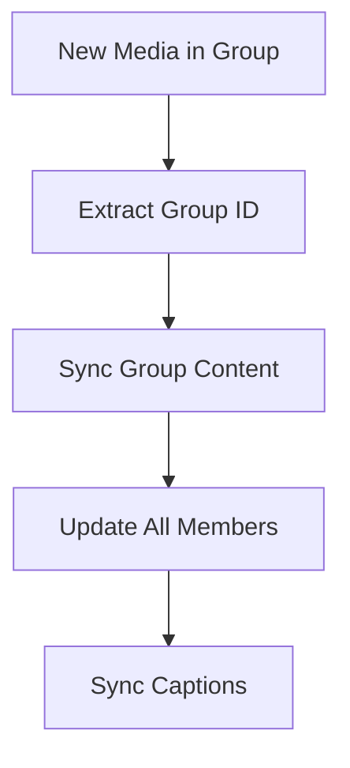
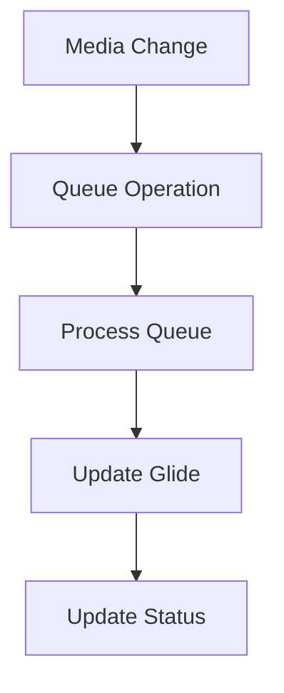

# Telegram Media Collection & Product Management System

A web application that automatically collects, processes, and manages media from Telegram channels while linking them to product data in Glide.

## System Architecture

### Edge Functions

1. **telegram-webhook**
   - Entry point for all Telegram updates
   - Validates webhook secrets and initializes processing
   - Handles message and media processing
   - Triggers caption analysis and media group synchronization

2. **sync-glide-media-table**
   - Manages bidirectional sync between Supabase and Glide
   - Processes the sync queue for media records
   - Handles create, update, and delete operations
   - Implements retry logic for failed operations

3. **analyze-caption**
   - AI-powered caption analysis
   - Extracts product information from message captions
   - Updates media records with analyzed content

4. **sync-missing-rows-to-glide**
   - Identifies and processes unsynced media records
   - Ensures data consistency between systems
   - Handles batch processing of missing records

### Shared Functions

1. **Data Management**
   - `database-service.ts`: Core database operations
   - `media-database.ts`: Media-specific database operations
   - `storage-manager.ts`: File storage operations

2. **Message Processing**
   - `message-processor.ts`: Main message handling
   - `message-manager.ts`: Message state management
   - `caption-analyzer.ts`: AI-powered caption analysis
   - `caption-sync.ts`: Syncs captions across media groups

3. **Media Handling**
   - `media-processor.ts`: Core media processing
   - `media-handler.ts`: Media state management
   - `media-validators.ts`: File validation
   - `media-group-handler.ts`: Media group operations
   - `metadata-extractor.ts`: Extracts media metadata

4. **Error Handling & Utilities**
   - `error-handler.ts`: Centralized error handling
   - `retry-utils.ts`: Retry mechanism utilities
   - `cleanup-manager.ts`: Resource cleanup

## Data Flow

### 1. Media Reception & Processing

1. Telegram sends update to webhook
2. Webhook function validates and processes message
3. Media files are downloaded and processed
4. Files are uploaded to Supabase storage
5. Records created in messages and telegram_media tables

### 2. Media Group Synchronization

1. System identifies media group membership
2. Group content is synchronized
3. All group members are updated with shared data
4. Captions and metadata are synced

### 3. Glide Synchronization

1. Changes trigger sync queue entries
2. Queue processor handles operations
3. Glide API updates are performed
4. Status and results are recorded

## Database Tables

1. **messages**
   - Stores raw message data
   - Tracks processing status
   - Links to media groups

2. **telegram_media**
   - Stores processed media files
   - Manages file metadata
   - Links to messages and groups

3. **media_groups**
   - Manages grouped media items
   - Synchronizes shared content
   - Tracks group status

4. **glide_sync_queue**
   - Manages sync operations
   - Tracks retry attempts
   - Records sync status

## Error Handling

1. **Retry Mechanism**
   - Configurable retry attempts
   - Exponential backoff
   - Error logging and tracking

2. **Failed Operations**
   - Stored in failed_media_operations
   - Automatic retry scheduling
   - Manual retry capability

## Features

- Media management dashboard with grid view
- Advanced filtering and search capabilities
- Product linking interface
- Telegram bot integration
- Glide integration
- Automatic caption analysis
- Media group synchronization
- Batch processing capabilities

## Tech Stack

- React with TypeScript
- Tailwind CSS for styling
- Supabase for backend
- shadcn/ui components
- Edge Functions for processing

## Getting Started

1. Clone the repository
2. Install dependencies: `npm install`
3. Start the development server: `npm run dev`

## Project Structure

- `/src/components`: React components
- `/src/pages`: Application pages
- `/src/hooks`: Custom React hooks
- `/src/lib`: Utility functions
- `/supabase/functions`: Edge Functions
- `/supabase/functions/_shared`: Shared utilities

## Contributing

1. Fork the repository
2. Create your feature branch
3. Commit your changes
4. Push to the branch
5. Create a new Pull Request

## Environment Variables

Required environment variables:
- `TELEGRAM_BOT_TOKEN`: Telegram Bot API token
- `TELEGRAM_WEBHOOK_SECRET`: Webhook verification secret
- `OPENAI_API_KEY`: For caption analysis
- `GLIDE_API_TOKEN`: Glide API access token

## Monitoring

Monitor the system through:
1. Edge Function logs in Supabase
2. Performance metrics table
3. Health check endpoints
4. Error tracking in failed operations tables