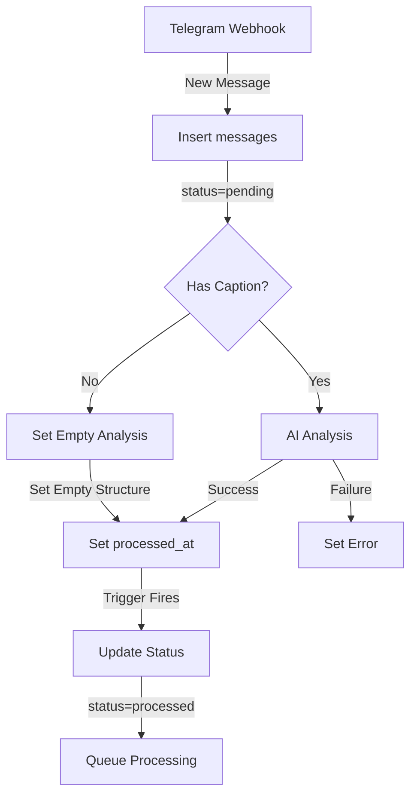

# Message Processing Flow

## Database Schema

### Messages Table
```sql
CREATE TABLE messages (
    id uuid PRIMARY KEY DEFAULT uuid_generate_v4(),
    message_id bigint NOT NULL,
    chat_id bigint NOT NULL,
    sender_info jsonb DEFAULT '{}'::jsonb,
    message_type text,
    telegram_data jsonb NOT NULL,
    caption text,
    media_group_id text,
    message_url text,
    analyzed_content jsonb,
    product_name text,
    product_code text,
    quantity integer,
    vendor_uid text,
    purchase_date timestamp with time zone,
    notes text,
    status text DEFAULT 'pending'::text,
    processed_at timestamp with time zone,
    processing_error text,
    created_at timestamp with time zone DEFAULT timezone('utc'::text, now()),
    updated_at timestamp with time zone DEFAULT timezone('utc'::text, now()),
    retry_count integer DEFAULT 0,
    last_retry_at timestamp with time zone,
    correlation_id uuid
);
```

### Unified Processing Queue Table
```sql
CREATE TABLE unified_processing_queue (
    id uuid PRIMARY KEY DEFAULT uuid_generate_v4(),
    queue_type text NOT NULL, -- 'webhook', 'media', 'media_group'
    data jsonb NOT NULL,
    status text DEFAULT 'pending'::text,
    priority integer DEFAULT 1,
    chat_id bigint,
    message_id bigint,
    correlation_id uuid,
    retry_count integer DEFAULT 0,
    max_retries integer DEFAULT 3,
    error_message text,
    created_at timestamp with time zone DEFAULT timezone('utc'::text, now()),
    updated_at timestamp with time zone DEFAULT timezone('utc'::text, now()),
    processed_at timestamp with time zone
);
```

## Message Processing States

1. **Initial State (Webhook Received)**
```json
{
    "status": "pending",
    "processed_at": null,
    "processing_error": null,
    "retry_count": 0,
    "analyzed_content": null
}
```

2. **After AI Analysis (With Caption)**
```json
{
    "status": "pending",
    "processed_at": "<timestamp>",
    "analyzed_content": {
        "product_name": "...",
        "product_code": "...",
        "quantity": 1,
        "vendor_uid": "...",
        "purchase_date": "...",
        "notes": "..."
    }
}
```

3. **After AI Analysis (No Caption)**
```json
{
    "status": "pending",
    "processed_at": "<timestamp>",
    "analyzed_content": {
        "product_name": null,
        "product_code": null,
        "quantity": null,
        "vendor_uid": null,
        "purchase_date": null,
        "notes": "No caption provided"
    }
}
```

4. **After Queue Trigger**
```json
{
    "status": "processed",
    "processed_at": "<timestamp>",
    "updated_at": "<new timestamp>"
}
```

## Processing Flow



## Functions & Triggers

### 1. Webhook Handler
```typescript
// webhook-handler.ts
async function handleWebhookUpdate(update, supabase, botToken, correlationId) {
    // 1. Create message record (status='pending')
    // 2. If caption exists:
    //    - Run AI analysis
    //    - Set analyzed_content with results
    // 3. If no caption:
    //    - Set empty analyzed_content structure
    // 4. Set processed_at when complete
}
```

### 2. Queue Trigger
```sql
-- Fires when:
-- 1. processed_at becomes non-null
-- 2. No processing errors
-- 3. Status is 'pending'
-- 4. analyzed_content is not null (empty structure for no caption)

CREATE TRIGGER queue_webhook_message_trigger
  AFTER UPDATE ON messages
  FOR EACH ROW
  WHEN (conditions...)
  EXECUTE FUNCTION queue_webhook_message();
```

### 3. Queue Processing Function
```sql
-- Actions:
-- 1. Updates message status to 'processed'
-- 2. Inserts into unified_processing_queue
-- 3. Sets appropriate queue_type and priority
```

## Media Group Handling

1. **Individual Messages**
- Each message in group starts as individual record
- Status flows independently
- Queue priority=1
- Each gets analyzed_content (empty if no caption)

2. **Group Processing**
- Identified by media_group_id
- Queue priority=2
- Shares analyzed_content across group if caption exists
- All members get empty analyzed_content if no caption in group

## Error Handling

1. **AI Analysis Errors**
```json
{
    "status": "pending",
    "processing_error": "Error description",
    "retry_count": 1,
    "last_retry_at": "<timestamp>"
}
```

2. **Queue Processing Errors**
```json
{
    "status": "error",
    "processing_error": "Queue processing failed",
    "retry_count": "Incremented",
    "last_retry_at": "<timestamp>"
}
```

## Monitoring Points

1. **Message Processing**
- Watch for messages stuck in 'pending'
- Monitor processing_error field
- Track retry_count for repeated failures
- Ensure all messages have analyzed_content (even if empty)

2. **Queue Health**
- Monitor queue size and processing rate
- Watch for items with high retry_count
- Check for correlation_id consistency

3. **Group Processing**
- Ensure all group items share analyzed_content
- Monitor for incomplete groups
- Check priority processing order 